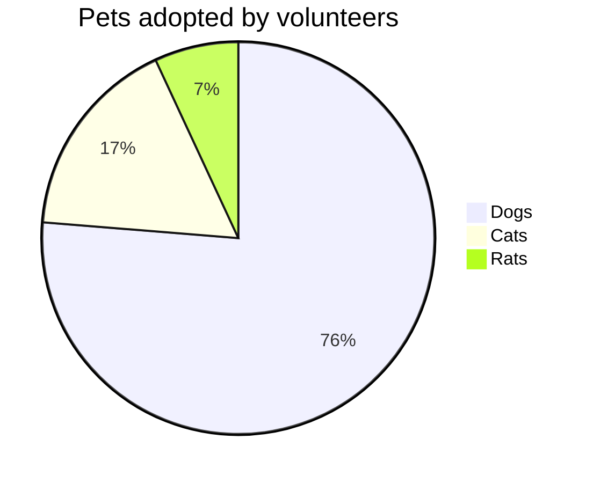
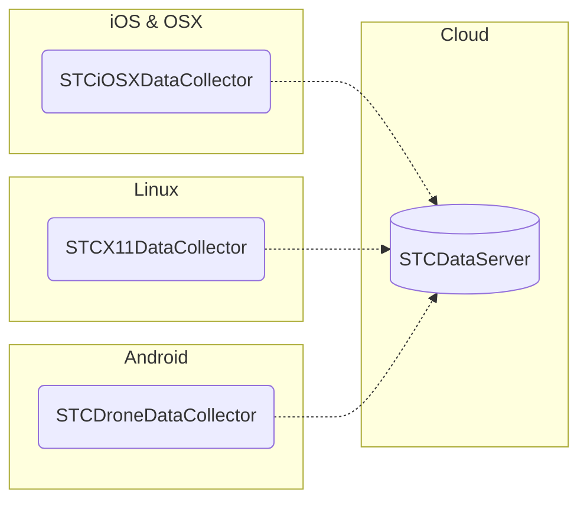

# STCData
System for collecting data from mobile devices and machine learning on it

@startmermaid
pie title Pets adopted by startmermaid
  "Dogs" : 386
  "Cats" : 85
  "Rats" : 35
@endmermaid

## Server

### [STCDataServer](https://github.com/STCData/STCDataServer)

A server that receives stream of timestamped data with evolution-resistant scheme from mobile clients, stores it in database, provides APIs for using it in machine learning

## Collectors

### [STCX11DataCollector](https://github.com/STCData/STCX11DataCollector)

Linux X11 application that logs windowing information, screenshots and recognized text, user actions

### [STCDroneDataCollector](https://github.com/STCData/STCDroneDataCollector)

Android drone control application that logs telemetry, video stream, recognized objects on video stream, user actions

### [STCiOSXDataCollector](https://github.com/STCData/STCiOSXDataCollector)

iOS/OSX application that logs detected text, human poses, window manager information and user actions from built in web browser, terminal emulator, camera, and any other external application

