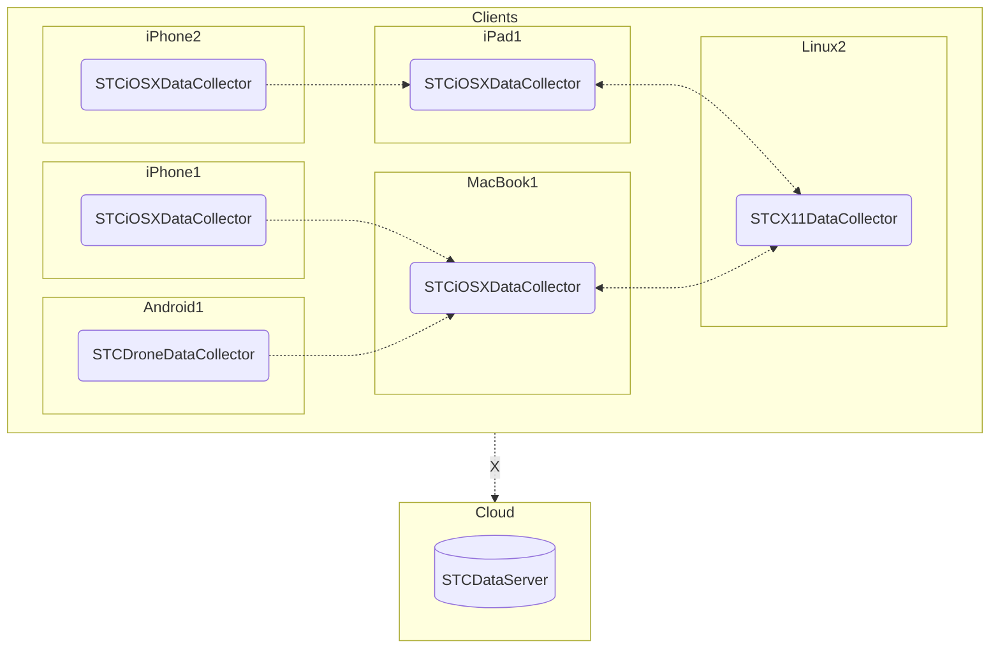

```mermaid
flowchart TB
 subgraph Clients
  subgraph iPhone1
    c1(STCiOSXDataCollector)
  end
  
  subgraph iPhone2
    c4(STCiOSXDataCollector)
  end
  
  subgraph iPad1
    c5(STCiOSXDataCollector)
  end
  
  subgraph MacBook1
    c2(STCiOSXDataCollector)
  end
  
  subgraph Linux2
    c6(STCX11DataCollector)
  end
  
  subgraph Android1
    c3(STCDroneDataCollector)
  end
  
 end
  subgraph Cloud
    sData[(STCDataServer)]
  end

    Clients -.->|X| Cloud
    c5 <-.-> c6
    c2 <-.-> c6
    c4 -.-> c5
    c1 -.-> c2
    c3 -.-> c2
```
