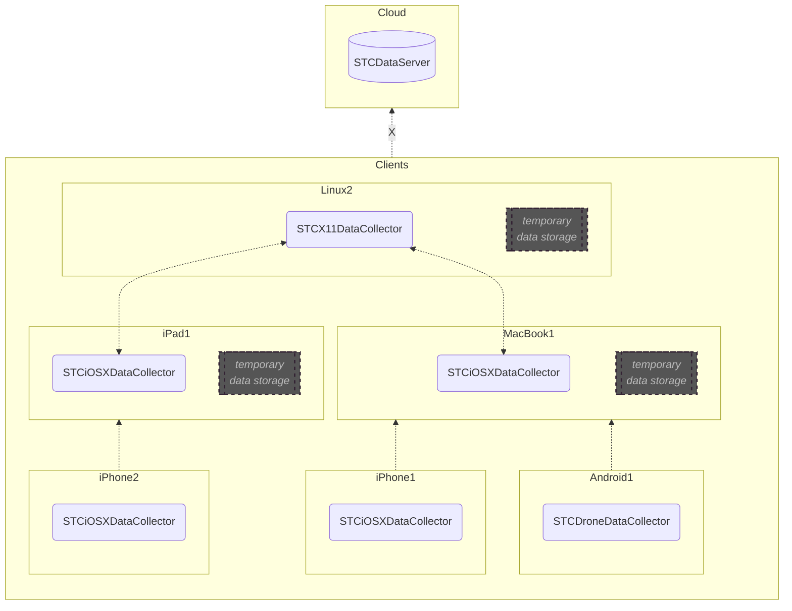

```mermaid


flowchart BT
 subgraph Clients
  direction BT
  subgraph iPhone1
    c1(STCiOSXDataCollector)
  end
  
  subgraph iPhone2
    c4(STCiOSXDataCollector)
  end
  
  subgraph iPad1
    c5(STCiOSXDataCollector)
    db5[[<i>temporary\ndata storage</i>]]
  end
  
  subgraph MacBook1
    c2(STCiOSXDataCollector)
    db2[[<i>temporary\ndata storage</i>]]
  end
  
  subgraph Linux2
    direction LR
    c6(STCX11DataCollector)
    db6[[<i>temporary\ndata storage</i>]]
  end
  
  subgraph Android1
    c3(STCDroneDataCollector)
  end
  
  classDef db fill:#555,stroke:#323,stroke-width:2px,color:#bbb,stroke-dasharray: 5 5
  class db5,db2,db6 db

 end
 subgraph Cloud
   sData[(STCDataServer)]
 end
 
 classDef realm fill:#333,stroke:#323,stroke-width:1px,color:#1ff,stroke-dasharray: 5 5

 class Cloud,Clients realm

    Clients -.->|X| Cloud
    c5 <-.-> c6
    c2 <-.-> c6
    iPhone2 -.-> iPad1
    iPhone1 -.-> MacBook1
    Android1 -.-> MacBook1
```
