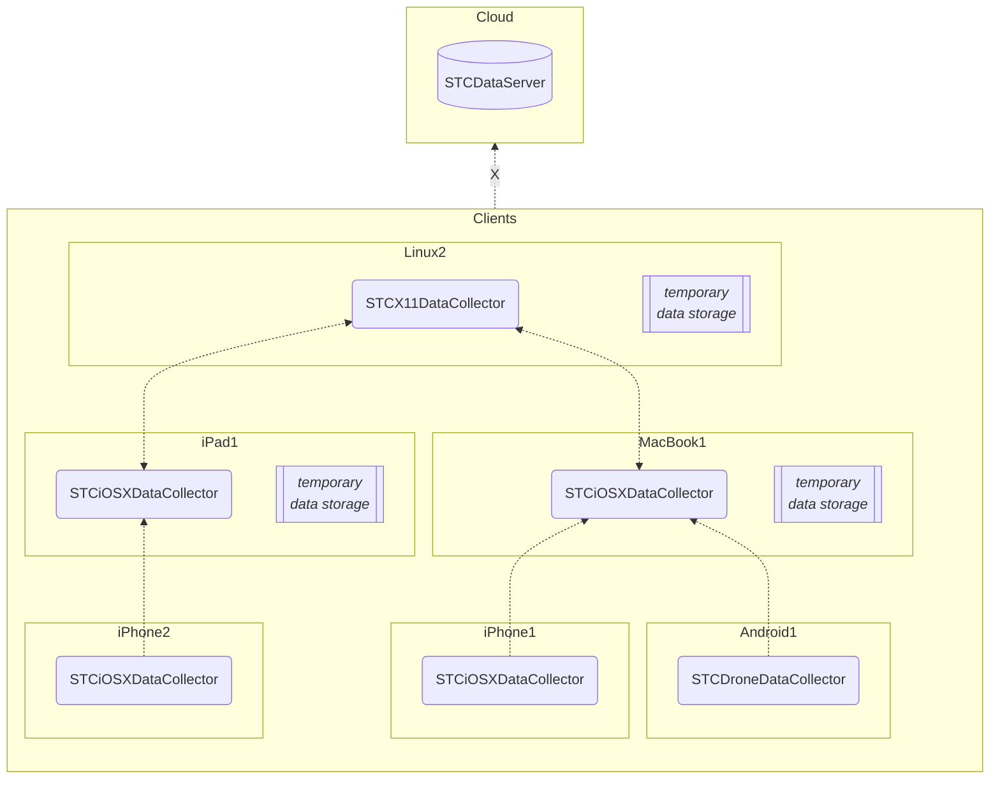

```mermaid
flowchart BT
 subgraph Clients
  direction BT
  subgraph iPhone1
    c1(STCiOSXDataCollector)
  end
  
  subgraph iPhone2
    c4(STCiOSXDataCollector)
  end
  
  subgraph iPad1
    c5(STCiOSXDataCollector)
    db5[[<i>temporary\ndata storage</i>]]
  end
  
  subgraph MacBook1
    c2(STCiOSXDataCollector)
    db2[[<i>temporary\ndata storage</i>]]
  end
  
  subgraph Linux2
    direction LR
    c6(STCX11DataCollector)
    db6[[<i>temporary\ndata storage</i>]]
  end
  
  subgraph Android1
    c3(STCDroneDataCollector)
  end
  
 end
  subgraph Cloud
    sData[(STCDataServer)]
  end

    Clients -.->|X| Cloud
    c5 <-.-> c6
    c2 <-.-> c6
    c4 -.-> c5
    c1 -.-> c2
    c3 -.-> c2
```
